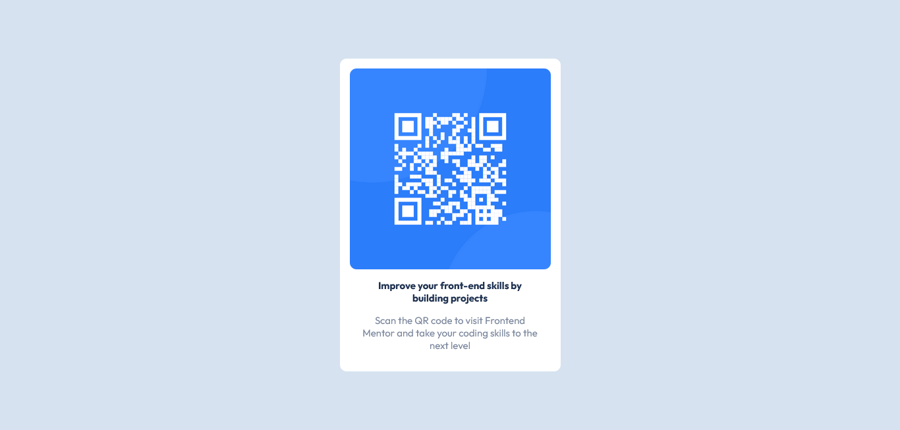

# Frontend Mentor - QR code component solution

This is a solution to the [QR code component challenge on Frontend Mentor](https://www.frontendmentor.io/challenges/qr-code-component-iux_sIO_H). Frontend Mentor challenges help you improve your coding skills by building realistic projects. 

## Table of contents

- [Overview](#overview)
  - [Screenshot](#screenshot)
  - [Links](#links)
- [My process](#my-process)
  - [Built with](#built-with)
  - [What I learned](#what-i-learned)
  - [Continued development](#continued-development)
  - [Useful resources](#useful-resources)
- [Author](#author)

## Overview

### Screenshot



### Links

- Solution URL: [qr-code-component](https://github.com/saulgutierrez/qr-code-component-main)
- Live Site URL: [qr-code-component](https://dapper-lollipop-75b55c.netlify.app/)

## My process

### Built with

- Semantic HTML5 markup
- Flexbox
- Google Fonts

### What I learned

Viewport properties.

```css
.proud-of-this-css {
  height: 100vh;
}
```

### Continued development

Use of CSS variables, and the :nth-child() selector.

### Useful resources

- [qr-generator](https://github.com/saulgutierrez/qr-generator) - This project help me to remember some basic concepts of CSS Flexbox.
- [W3Schools](https://www.w3schools.com) - Main source of documentation about web development

## Author

- Website - [Saúl Gutiérrez](https://sauladai.netlify.app/)
- Frontend Mentor - [@saulgutierrez](https://www.frontendmentor.io/profile/saulgutierrez)